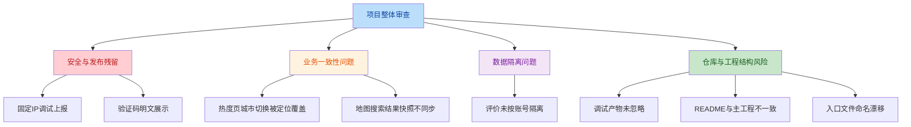

# 泳池水质通项目审查报告

## 1. 审查范围

本次审查基于当前仓库实际内容，对以下范围进行了整体检查：

- iOS 主工程：`ios/SwimWaterQualityApp`
- 根目录 Web 壳工程：`src/`、`package.json`
- 项目级配置与文档：`.gitignore`、根目录 `README.md`
- 调试产物与仓库残留：`.dbg/`、临时调试文档

本报告分为两类：

- 已确认问题：可直接从代码定位、影响明确
- 结构与协作风险：短期可能不阻塞使用，但会影响后续维护、发布或协作

## 2. 总体结论

当前项目已经具备较完整的 iOS 端原型能力，主流程基本可用，但仍存在以下几类风险：

- 安全与发布残留
- 多账号数据隔离不完整
- 地图 / 热度页面的状态一致性问题
- 仓库结构与工程边界不清晰

其中，优先级最高的是：

1. 地图页仍残留对固定 IP 的调试上报
2. 验证码仍会以明文形式出现在 UI 和控制台
3. 本地评价没有按账号隔离

## 3. 问题概览

## 4. 已确认问题

| 编号 | 级别 | 问题 | 影响 | 建议 |
|---|---|---|---|---|
| 1 | 高 | 地图页残留固定 IP 调试上报（已修复） | 用户搜索内容会被直接 POST 到局域网地址，存在隐私与发布风险 | 彻底删除调试上报逻辑，并移除相关调试状态 |
| 2 | 高 | 验证码以明文显示在 UI 和控制台 | 认证凭证泄露，真实环境下不可接受 | 移除 `debugCodeHint` 展示与 `print` 输出，验证码仅在服务端校验 |
| 3 | 中高 | 自定义评价未按账号隔离 | 同一设备切换账号后，会看到其他账号写入的本地评价 | 存储结构按 `userID/email + venueID` 隔离，或改由服务端持久化 |
| 4 | 中 | 热度页手动切换城市会被定位同步覆盖 | 用户手动切城后，可能被自动切回定位城市，体验不稳定 | 增加“手动选择优先”状态，停止无条件覆盖 `currentCity` |
| 5 | 中 | 地图搜索结果 sheet 与城市变化不同步 | 切城后搜索结果可能仍显示旧城市快照 | 城市变化时同步重建搜索展示模型，避免旧快照残留 |

### 4.1 问题 1：地图页残留固定 IP 调试上报

- 说明：此前 `TrainingView.swift` 内存在 `reportMapSearchDebugEvent`，会把搜索词、结果数量、城市等信息发送到固定地址 `http://192.168.0.167:7777/event`。
- 风险：
  - 属于调试代码残留
  - 搜索行为会外发
  - 发布版本中不应保留
- 处理结果：已移除 `reportMapSearchDebugEvent` 及其全部调用点，发布版本不再包含固定 IP 调试上报逻辑。

### 4.2 问题 2：验证码以明文显示在 UI 和控制台

- 说明：当前验证码既会通过 `print` 输出到控制台，也会通过 `debugCodeHint` 直接显示在注册、改邮箱、改密码页面。
- 风险：
  - 认证链路被弱化
  - 真实环境存在明显安全问题
  - 很容易被遗漏进发布版本
- 关键位置：
  - 控制台输出：
    - [CounterStore.swift:L568-L568](file:///Users/david/trae/projrct4/ios/SwimWaterQualityApp/CounterStore.swift#L568-L568)
  - 注册页展示：
    - [OnboardingView.swift:L164-L164](file:///Users/david/trae/projrct4/ios/SwimWaterQualityApp/OnboardingView.swift#L164-L164)
    - [OnboardingView.swift:L229-L230](file:///Users/david/trae/projrct4/ios/SwimWaterQualityApp/OnboardingView.swift#L229-L230)
  - 修改邮箱展示：
    - [SettingsView.swift:L665-L665](file:///Users/david/trae/projrct4/ios/SwimWaterQualityApp/SettingsView.swift#L665-L665)
    - [SettingsView.swift:L700-L701](file:///Users/david/trae/projrct4/ios/SwimWaterQualityApp/SettingsView.swift#L700-L701)
  - 修改密码展示：
    - [SettingsView.swift:L775-L775](file:///Users/david/trae/projrct4/ios/SwimWaterQualityApp/SettingsView.swift#L775-L775)
    - [SettingsView.swift:L830-L831](file:///Users/david/trae/projrct4/ios/SwimWaterQualityApp/SettingsView.swift#L830-L831)

### 4.3 问题 3：自定义评价未按账号隔离

- 说明：本地评价使用固定 key `swim_quality.custom_reviews` 存在 `UserDefaults`，读取和展示时只按 `venue.id` 聚合，没有按当前用户隔离。
- 风险：
  - 切换账号后会看到其他账号的本地评价
  - 数据归属和隐私边界不正确
- 关键位置：
  - 存储 key：
    - [CounterStore.swift:L24-L32](file:///Users/david/trae/projrct4/ios/SwimWaterQualityApp/CounterStore.swift#L24-L32)
  - 初始化加载：
    - [CounterStore.swift:L39-L50](file:///Users/david/trae/projrct4/ios/SwimWaterQualityApp/CounterStore.swift#L39-L50)
  - 读取展示：
    - [CounterStore.swift:L128-L130](file:///Users/david/trae/projrct4/ios/SwimWaterQualityApp/CounterStore.swift#L128-L130)
  - 提交与保存：
    - [CounterStore.swift:L341-L369](file:///Users/david/trae/projrct4/ios/SwimWaterQualityApp/CounterStore.swift#L341-L369)

### 4.4 问题 4：热度页手动切换城市会被定位同步覆盖

- 说明：热度页支持手动切换城市，但页面 `onAppear` 和 `onChange(of: store.userLocation)` 又会再次调用 `syncCurrentCityToUserLocation()`。
- 风险：
  - 用户刚切到上海，后续可能被自动切回北京
  - 城市选择交互不稳定
- 关键位置：
  - 页面触发：
    - [StatsView.swift:L119-L130](file:///Users/david/trae/projrct4/ios/SwimWaterQualityApp/StatsView.swift#L119-L130)
  - 城市切换入口：
    - [StatsView.swift:L168-L191](file:///Users/david/trae/projrct4/ios/SwimWaterQualityApp/StatsView.swift#L168-L191)
  - Store 同步逻辑：
    - [CounterStore.swift:L202-L207](file:///Users/david/trae/projrct4/ios/SwimWaterQualityApp/CounterStore.swift#L202-L207)

### 4.5 问题 5：地图搜索结果 sheet 与城市变化不同步

- 说明：搜索弹层展示的是 `searchPresentation` 快照；城市变化时只更新 `searchResults`，没有同步重建 `searchPresentation`。
- 风险：
  - 用户切换城市后，搜索结果 sheet 仍可能显示旧城市结果
  - 状态来源重复，容易继续引发搜索展示类问题
- 关键位置：
  - 状态定义：
    - [TrainingView.swift:L50-L50](file:///Users/david/trae/projrct4/ios/SwimWaterQualityApp/TrainingView.swift#L50-L50)
  - 城市变化时仅更新结果：
    - [TrainingView.swift:L104-L107](file:///Users/david/trae/projrct4/ios/SwimWaterQualityApp/TrainingView.swift#L104-L107)
  - sheet 依赖快照：
    - [TrainingView.swift:L116-L119](file:///Users/david/trae/projrct4/ios/SwimWaterQualityApp/TrainingView.swift#L116-L119)
  - 搜索时创建快照：
    - [TrainingView.swift:L350-L355](file:///Users/david/trae/projrct4/ios/SwimWaterQualityApp/TrainingView.swift#L350-L355)

## 5. 结构与协作风险

| 编号 | 级别 | 风险 | 影响 | 建议 |
|---|---|---|---|---|
| 6 | 中 | 调试产物未忽略且仍保留在仓库中 | 容易污染仓库、误提交临时文件 | 补充 `.gitignore`，清理 `.dbg` 与临时调试文档 |
| 7 | 中 | 根目录 README 与主项目实际内容不一致 | 容易误导成员运行 Web 壳工程而不是 iOS 主工程 | 将根 README 改为项目总览，区分主工程与历史壳工程 |
| 8 | 低 | App 入口文件名仍为 `StudentCounterApp.swift` | 搜索、脚本和协作认知容易混乱 | 重命名为 `SwimWaterQualityApp.swift` 并同步工程引用 |
| 9 | 低 | 根目录保留了一个几乎空白的 React 壳工程 | 会混淆“管理后台 / Web 端是否已实现”的判断 | 明确标注用途，或迁出到独立目录 / 独立仓库 |

### 5.1 风险 6：调试产物未忽略且仍保留在仓库中

- 当前 `.gitignore` 没有忽略 `.dbg/`
- 当前仓库内已存在调试日志与环境文件
- 关键位置：
  - [.gitignore](file:///Users/david/trae/projrct4/.gitignore)
  - [.dbg](file:///Users/david/trae/projrct4/.dbg)
  - [debug-map-search-first-empty.md](file:///Users/david/trae/projrct4/debug-map-search-first-empty.md)

### 5.2 风险 7：根目录 README 与主项目实际内容不一致

- 当前根目录 `README.md` 仍是默认 `React + TypeScript + Vite` 模板说明
- 但当前实际主工程是 iOS 项目 `ios/SwimWaterQualityApp`
- 关键位置：
  - [README.md](file:///Users/david/trae/projrct4/README.md)
  - [ios/SwimWaterQualityApp/README.md](file:///Users/david/trae/projrct4/ios/SwimWaterQualityApp/README.md)

### 5.3 风险 8：App 入口文件命名漂移

- 当前实际 App 名为 `SwimWaterQualityApp`
- 但入口文件仍命名为 `StudentCounterApp.swift`
- 关键位置：
  - [StudentCounterApp.swift](file:///Users/david/trae/projrct4/ios/SwimWaterQualityApp/StudentCounterApp.swift)

### 5.4 风险 9：根目录保留空白 Web 壳工程

- 根目录存在 `React + Vite` 工程
- 当前只有极少路由，页面几乎为空
- 容易让人误判“后台已存在”或“Web 主体已实现”
- 关键位置：
  - [package.json](file:///Users/david/trae/projrct4/package.json)
  - [App.tsx](file:///Users/david/trae/projrct4/src/App.tsx)
  - [Home.tsx](file:///Users/david/trae/projrct4/src/pages/Home.tsx)

## 6. 建议修复优先级

### P0：必须优先处理

- 删除地图页固定 IP 调试上报
- 删除验证码明文展示与控制台输出
- 清理调试产物并补齐 `.gitignore`

### P1：影响核心体验与数据正确性

- 评价改为按账号隔离
- 热度页加入“手动切城优先”机制
- 地图搜索结果状态去重，消除旧快照问题

### P2：提升协作与长期可维护性

- 重写根目录 README
- 整理空白 Web 壳工程定位
- 统一入口文件命名

## 7. 当前建议

如果按“最小投入、最大收益”的顺序推进，建议下一步按下面 3 组执行：

1. 安全与发布清理
   - 调试上报
   - 明文验证码
   - `.dbg` / 临时调试文件

2. 核心状态一致性修复
   - 热度页城市切换
   - 地图搜索结果状态模型
   - 评价账号隔离

3. 仓库整理
   - 根 README
   - 入口命名
   - Web 壳工程定位
