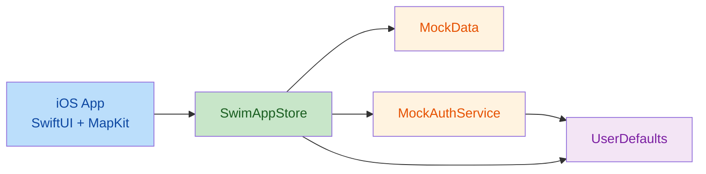
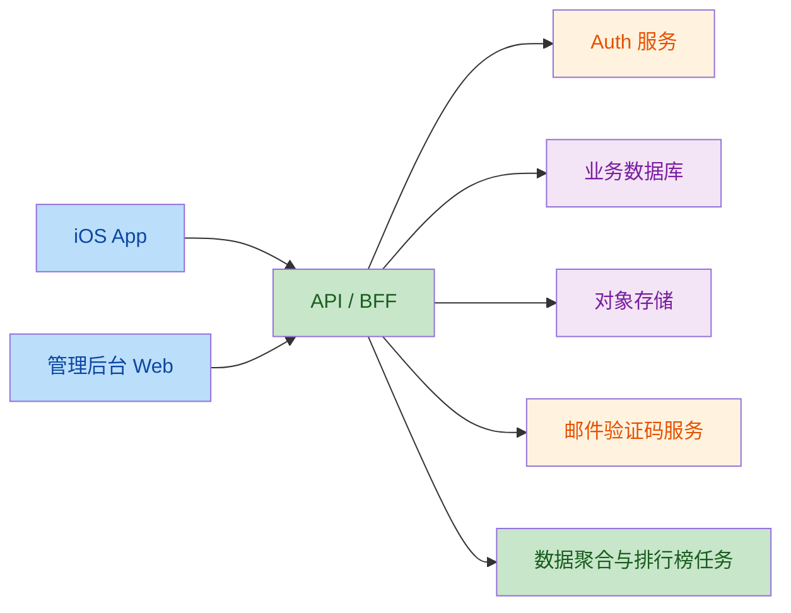

# 泳池水质通技术方案

## 1. 文档目标

本文档基于当前仓库实际内容整理，覆盖以下三部分：

- App 端：当前已实现的 iOS 客户端技术方案
- 服务端：当前仓库内的真实现状，以及正式版建议架构
- 管理后台：当前仓库内的真实现状，以及正式版建议架构

说明：

- 本文档严格区分“已实现”和“规划建议”
- 未在当前仓库中落地的能力，不视为已实现
- 当前项目的主体交付物是 iOS App，服务端与管理后台仍处于规划阶段

## 2. 当前项目全景

### 2.1 仓库结构概览

当前仓库主要包含两部分：

1. `ios/SwimWaterQualityApp`
   - 当前主工程
   - 已实现较完整的 iOS App 原型与核心流程

2. 项目根目录 `src/` + `package.json`
   - 一个早期的 React + Vite Web 壳工程
   - 当前没有形成完整的服务端或管理后台交付物

### 2.2 当前实现状态总览

| 模块 | 当前状态 | 说明 |
|---|---|---|
| iOS App | 已实现 | 已完成认证、地图、热度、我的、详情等核心闭环 |
| 服务端 | 未独立实现 | 当前由 App 内的 Mock 服务和本地持久化模拟 |
| 管理后台 | 未实现 | 当前仓库只有早期 Web 壳工程，不是可用后台 |
| 数据库 | 未独立实现 | 当前主要依赖 `UserDefaults` + Mock 数据 |
| 部署链路 | 未完整实现 | 当前以 Xcode 本地运行为主 |

## 3. 总体技术架构

### 3.1 当前阶段架构

当前版本本质上是一个“高保真本地原型”：

- 前端主体验已完成
- 业务状态集中在 `SwimAppStore`
- 账号、评价、关注、会话等能力由本地模拟服务承载
- 地图与数据展示闭环可跑通
- 暂无真实服务端、数据库、后台管理系统

### 3.2 正式版目标架构

正式版建议将 App、服务端、管理后台拆成三层：

- App 端负责交互、地图、展示和本地缓存
- 服务端负责认证、验证码、用户资料、泳馆数据、评价、关注、热度计算
- 管理后台负责泳馆资料、水质数据、评价审核、用户管理和运营看板

## 4. App 端技术方案

### 4.1 当前已实现能力

当前 iOS App 已实现以下主要模块：

- 登录/注册/验证码/密码登录
- 地图页、定位权限、地图搜索、地图标注、地图详情跳转
- 热度页、同城 Top3、排行榜、专题列表
- 我的页、头像上传、昵称修改、关注列表、修改密码
- 泳馆详情页、关注/取消关注、评价提交、评价展示
- 启动页与品牌视觉资源

### 4.2 技术栈

- UI 框架：`SwiftUI`
- 地图能力：`MapKit`
- 定位能力：`CoreLocation`
- 图片选择：`PhotosUI`
- 本地持久化：`UserDefaults`
- 触感反馈：`UIKit Haptics`
- 局部 UIKit 桥接：自定义搜索输入框

### 4.3 当前工程结构

主要文件及职责如下：

- `StudentCounterApp.swift`
  - App 入口
  - 注入全局 `SwimAppStore`
  - 切换加载页 / 登录态 / 主 Tab

- `RootView.swift`
  - 底部三个主 Tab 容器
  - 地图、热度、我的入口

- `CounterStore.swift`
  - 全局状态中心
  - 认证、城市、地图相机、定位、关注、评价等业务逻辑

- `Models.swift`
  - 用户、城市、泳馆、水质、评价等核心数据模型

- `MockData.swift`
  - 场馆 Mock 数据
  - 北京 / 上海 / 深圳共 50 条数据

- `OnboardingView.swift`
  - 注册 / 登录 / 验证码流程

- `TrainingView.swift`
  - 地图页
  - 搜索框、MapKit、标注、结果 Sheet

- `StatsView.swift`
  - 热度页
  - Top3、同城排行、专题入口与专题列表

- `SettingsView.swift`
  - 我的页
  - 资料管理、头像上传、修改密码、我的关注

- `CompletionSheet.swift`
  - 泳馆详情页
  - 关注、评价、水质详情展示

- `DesignTokens.swift`
  - 全局设计系统
  - 间距、圆角、材质、按钮、卡片、动画

### 4.4 App 端模块设计

#### 4.4.1 认证模块

当前实现方式：

- 通过 `AuthFlowView` 承载登录前流程
- 注册采用邮箱 + 验证码 + 设置密码
- 后续登录采用邮箱 + 密码
- 修改密码支持验证码校验后重置密码

当前数据来源：

- `MockAuthService`
- `UserDefaults`

正式版建议：

- 接入真实认证服务
- 验证码改由服务端下发和校验
- 会话 token 改为服务端签发
- 本地仅保存安全会话信息，不保存联调验证码

#### 4.4.2 地图模块

当前实现方式：

- 使用 `MapKit` 渲染地图
- 支持用户当前位置
- 支持城市内泳馆 `Marker`
- 顶部搜索框搜索泳馆
- 搜索结果通过底部 `sheet` 展示
- 点击标注或列表项进入详情页

当前特点：

- 地图交互已经可用
- 已做过多轮性能收敛
- 搜索逻辑已从“输入即搜索”改为“提交后搜索”

正式版建议：

- 搜索结果改为服务端检索或本地索引 + 服务端结果融合
- 引入更稳健的搜索状态同步模型
- 将城市切换、搜索快照和地图相机联动进一步拆分成独立状态对象

#### 4.4.3 热度模块

当前实现方式：

- 同城 Top3
- 同城排行列表
- 新上场馆 / 优质等级 / 上升最快专题列表
- 支持城市切换

当前排序来源：

- 以 `MockData` 为基础
- 通过 `SwimAppStore` 计算派生列表

正式版建议：

- 热度榜由服务端统一聚合
- 区分“总关注人数”“近期增长”“城市筛选”
- 将专题页改为可复用的排行榜配置模型

#### 4.4.4 我的模块

当前实现方式：

- 展示头像、昵称、邮箱、我的关注
- 支持头像上传
- 支持昵称修改
- 支持查看我的关注
- 支持修改密码与退出登录

正式版建议：

- 头像改为对象存储 URL
- 用户资料改为服务端接口读写
- 增加账号安全日志、设备管理、注销能力

#### 4.4.5 详情与评价模块

当前实现方式：

- 展示泳馆基础信息
- 展示水质概览与完整指标
- 展示评价列表
- 支持关注 / 取消关注
- 支持新增评价

正式版建议：

- 评价写入服务端数据库
- 支持审核状态、举报、排序
- 支持多图评价和评分字段

### 4.5 App 端状态管理

当前采用“单全局 Store + 页面局部 State”的模式：

- 全局状态：`SwimAppStore`
- 页面局部状态：搜索词、路径、sheet、toast、表单输入等

优点：

- 原型阶段开发效率高
- 状态集中，便于多页共享

问题：

- Store 职责偏大
- 认证、地图、热度、评价耦合在同一对象中
- 后续接真实后端时维护成本会明显上升

正式版建议拆分为：

- `AuthStore`
- `MapStore`
- `TrendingStore`
- `ProfileStore`
- `VenueDetailStore`

### 4.6 App 端数据层

当前数据来源分三类：

1. `MockData`
   - 场馆主数据
   - 城市区域数据
   - 排行基础数据

2. `MockAuthService`
   - 注册 / 登录 / 验证码 / 修改密码模拟

3. `UserDefaults`
   - 当前登录态
   - 地图模式
   - 当前城市
   - 用户资料
   - 自定义评价

正式版建议：

- 将 `MockData` 替换为服务端接口
- 将 `MockAuthService` 替换为真实认证服务
- 将 `UserDefaults` 收缩为：
  - 会话缓存
  - 轻量 UI 配置
  - 非核心离线缓存

## 5. 服务端技术方案

### 5.1 当前现状

当前仓库内没有独立服务端工程。

目前“服务端能力”实际由 App 内本地模拟完成：

- 用户注册 / 登录 / 验证码：`MockAuthService`
- 用户资料更新：`MockAuthService`
- 关注关系：`UserDefaults`
- 评价持久化：`UserDefaults`
- 排行与专题：App 本地计算

因此，当前仓库里的服务端状态应定义为：

- 无独立服务
- 无真实 API
- 无真实数据库
- 无真实邮件验证码投递

### 5.2 正式版目标职责

正式版服务端需要承担以下职责：

- 用户账号体系
- 邮箱验证码发送与校验
- 用户资料读写
- 泳馆主数据管理
- 水质报告管理
- 评价管理
- 关注关系管理
- 热度榜与专题榜计算
- 文件上传签名与资源管理

### 5.3 建议技术选型

基于当前仓库已有依赖和项目规模，建议两种路线二选一：

#### 方案 A：Supabase 轻服务架构

适合首版快速上线。

- Auth：`Supabase Auth`
- Database：`PostgreSQL`
- Storage：`Supabase Storage`
- Server Logic：`Edge Functions`
- Email：第三方邮件服务 + Edge Function 封装

优点：

- 开发快
- 成本低
- 适合当前产品体量

适用场景：

- 首版验证
- 中轻量数据规模
- 团队后端资源有限

#### 方案 B：独立 API 服务架构

适合后续正式产品化扩展。

- API：`Node.js + NestJS` 或 `Fastify`
- Database：`PostgreSQL`
- Cache：`Redis`
- Storage：`S3 / OSS / COS`
- Email：`SendGrid / Resend / SMTP`
- Job：定时任务计算热度和排行榜

优点：

- 业务边界更清晰
- 扩展性更强
- 更适合复杂后台与运营需求

### 5.4 建议服务端模块

- `auth-service`
  - 注册
  - 登录
  - 邮箱验证码
  - 修改密码
  - 会话校验

- `user-service`
  - 用户资料
  - 头像
  - 昵称
  - 邮箱

- `venue-service`
  - 泳馆主表
  - 城市 / 区域
  - 场馆检索

- `water-quality-service`
  - 水质报告
  - 检测时间
  - 指标历史

- `review-service`
  - 评价新增
  - 评价列表
  - 审核状态

- `follow-service`
  - 关注 / 取消关注
  - 我的关注
  - 关注统计

- `ranking-service`
  - 同城 Top3
  - 热度榜
  - 新上场馆
  - 上升最快

### 5.5 核心 API 建议

#### 认证类

- `POST /auth/send-code`
- `POST /auth/verify-code`
- `POST /auth/register`
- `POST /auth/login`
- `POST /auth/change-password`
- `POST /auth/change-email`
- `POST /auth/logout`

#### 用户类

- `GET /me`
- `PATCH /me/profile`
- `POST /me/avatar/upload`
- `GET /me/follows`

#### 泳馆类

- `GET /venues`
- `GET /venues/search`
- `GET /venues/{id}`
- `GET /venues/{id}/water-quality`
- `GET /venues/{id}/reviews`
- `POST /venues/{id}/reviews`

#### 关注与榜单类

- `POST /venues/{id}/follow`
- `DELETE /venues/{id}/follow`
- `GET /trending/city`
- `GET /trending/new-arrivals`
- `GET /trending/excellent`
- `GET /trending/rising`

### 5.6 数据库模型建议

正式版建议至少包含以下表：

- `users`
- `user_sessions`
- `email_verification_codes`
- `cities`
- `districts`
- `venues`
- `venue_water_quality_reports`
- `venue_reviews`
- `venue_review_images`
- `venue_follows`
- `venue_ranking_snapshots`
- `audit_logs`

### 5.7 服务端关键规则

- 验证码只在服务端生成与校验
- 验证码不回传客户端
- 关注总数由服务端维护
- 榜单结果由服务端统一聚合
- 评价必须带用户维度和审核状态
- 用户资料修改需做权限校验和风控

## 6. 管理后台技术方案

### 6.1 当前现状

当前仓库没有已实现的管理后台。

根目录存在一个 React + Vite Web 壳工程，但当前状态是：

- 路由极少
- 页面为空
- 未形成后台系统
- 未接入真实服务端

因此，当前后台实现状态应定义为：

- 有前端壳工程
- 无实际后台业务功能
- 无登录、无权限、无看板、无数据管理页面

### 6.2 管理后台目标定位

后台主要面向运营、内容管理和数据维护人员，承担以下职责：

- 泳馆资料管理
- 水质报告录入与维护
- 用户评价审核
- 用户信息查看与风控
- 城市和区域管理
- 榜单与运营数据查看

### 6.3 建议技术选型

考虑当前仓库根目录已有依赖：

- `React`
- `TypeScript`
- `react-router-dom`
- `zustand`
- `@supabase/supabase-js`
- `recharts`

建议后台继续沿用这套技术栈：

- 前端框架：`React + TypeScript + Vite`
- 路由：`react-router-dom`
- 状态管理：`zustand`
- 图表：`recharts`
- UI：建议补充统一组件库
- 权限：基于服务端角色或 Supabase Auth Role

### 6.4 后台模块建议

- 登录页
- 仪表盘首页
- 泳馆管理
- 水质报告管理
- 用户评价审核
- 用户管理
- 榜单与趋势分析
- 运营配置

### 6.5 后台页面建议

#### 6.5.1 仪表盘

展示：

- 总用户数
- 总泳馆数
- 今日新增评价
- 今日新增关注
- 城市维度热度趋势
- 异常水质场馆提醒

#### 6.5.2 泳馆管理

支持：

- 新增 / 编辑 / 下线泳馆
- 维护地址、经纬度、城市、区域
- 维护场馆封面图

#### 6.5.3 水质报告管理

支持：

- 新增检测记录
- 编辑检测指标
- 设置更新时间
- 查看单馆历史报告

#### 6.5.4 评价管理

支持：

- 查看用户评价
- 审核 / 屏蔽 / 删除评价
- 举报处理

#### 6.5.5 用户管理

支持：

- 查看用户资料
- 查看关注关系
- 查看评价历史
- 风控处理

### 6.6 后台权限模型建议

至少划分以下角色：

- `super_admin`
- `ops_admin`
- `content_admin`
- `auditor`

权限边界建议：

- 超级管理员：全部权限
- 运营管理员：场馆与榜单配置
- 内容管理员：评价与内容管理
- 审核员：仅评价审核和违规处理

## 7. 数据与业务边界

### 7.1 当前阶段

当前业务边界是：

- App 可独立运行
- 数据为本地模拟
- 适合原型演示、UI 打磨和流程验证

### 7.2 正式版边界

正式版建议明确三端职责：

- App 端：消费接口、做交互和本地缓存
- 服务端：保存真实数据并输出统一业务规则
- 管理后台：维护业务数据并提供运营能力

## 8. 环境与部署建议

### 8.1 App 端

- 开发工具：`Xcode 16+`
- 平台：`iOS 17+`
- 运行方式：Xcode 模拟器 / 真机

### 8.2 服务端

建议至少区分：

- `dev`
- `staging`
- `prod`

建议配置：

- 独立数据库
- 独立对象存储
- 独立邮件服务配置
- 独立 API Base URL

### 8.3 管理后台

建议部署方式：

- 静态资源托管
- 独立后台域名
- 接正式服务端 API
- 接统一登录鉴权

## 9. 分阶段实施建议

### Phase 1：当前已完成

- 完成 iOS 原型主链路
- 打通登录、地图、热度、我的、详情
- 建立品牌视觉与启动资源
- 完成 50 条 Mock 数据与多城市结构

### Phase 2：服务端最小闭环

- 接入真实认证
- 接入真实验证码邮件
- 建立用户、场馆、评价、关注数据库
- 接通 App 登录、资料、关注、评价接口

### Phase 3：管理后台上线

- 建立后台登录与权限
- 实现场馆与水质报告管理
- 实现评价审核和运营看板

### Phase 4：产品正式化

- 榜单聚合服务化
- 图片上传服务化
- 风控与日志体系
- 监控、告警、发布流程

## 10. 当前项目结论

基于当前仓库，最准确的技术判断是：

- App 端已经形成可运行、可演示、可持续打磨的主产品原型
- 服务端尚未独立落地，当前由 App 内的本地模拟逻辑承担
- 管理后台尚未开始正式实现，当前只有 Web 技术栈壳工程

因此，当前项目最适合的推进路径不是“继续堆 App 本地逻辑”，而是：

1. 先稳定 App 端现有体验和问题收敛
2. 尽快建立正式服务端最小闭环
3. 再补管理后台，形成数据维护能力

## 11. 对应关键路径

### App 端

- `ios/SwimWaterQualityApp/StudentCounterApp.swift`
- `ios/SwimWaterQualityApp/RootView.swift`
- `ios/SwimWaterQualityApp/CounterStore.swift`
- `ios/SwimWaterQualityApp/Models.swift`
- `ios/SwimWaterQualityApp/MockData.swift`
- `ios/SwimWaterQualityApp/OnboardingView.swift`
- `ios/SwimWaterQualityApp/TrainingView.swift`
- `ios/SwimWaterQualityApp/StatsView.swift`
- `ios/SwimWaterQualityApp/SettingsView.swift`
- `ios/SwimWaterQualityApp/CompletionSheet.swift`
- `ios/SwimWaterQualityApp/DesignTokens.swift`

### 文档

- `ios/SwimWaterQualityApp/ProductPlan.md`
- `ios/SwimWaterQualityApp/PrototypeDesign.md`
- `ios/SwimWaterQualityApp/README.md`

### 当前 Web 壳工程

- `package.json`
- `src/App.tsx`
- `src/pages/Home.tsx`
- `README.md`
